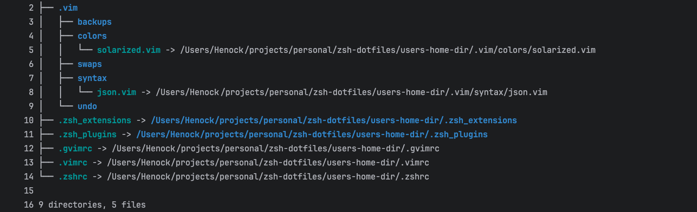

## Henock's extensions to the .zshrc 

A set zshrc functions and aliases, that I have found useful predominantly from the .dotfiles  I used to use before
OSX moved to zsh.


### Alias examples
```bash
# clear the screen
alias c='clear'

# List directory contents
alias ls='ls -G'            # -G show with colors
alias l='ls -ltrh'          # ls reversed modified timestamp, human readable
alias ll='l'
alias la='l -A'             # -A includes directory entries whose names begin with a dot (‘.’) except for . and ...
alias lsd="la | grep '^d'"  # show directories only
alias cl="clear && l"
alias cla="clear && la"
alias clsd="clear && lsd"
alias ldot='ls -ld .*'      # show dot files only (only works for current directory)

```


Also included is the [zsh-syntax-highlighting](https://github.com/zsh-users/zsh-syntax-highlighting/tree/master)
utility that colours the command line as you type.

The [deploy-to-home-folder.sh](./deploy-to-home-folder.sh) script deploys the .zsh-dotfiles to your home folder. Backing up and then replacing the respective files and folders.

The deployed files are actually symlinked back to the files in this project (allowing you to version control them in git outside your home directory).

### The File structure in your home folder looks as follows




## Inspired by dotfiles created by Mathias

| [](http://twitter.com/mathias "Follow @mathias on Twitter") |
|---|
| [Mathias Bynens](https://mathiasbynens.be/) |
