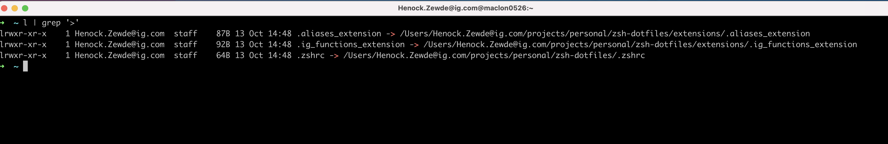

## Henock's extensions to the .zshrc 

## Installation

**Warning:** If you want to give these dotfiles a try, you should first fork this repository, review the code, and remove things you don’t want or need. Don’t blindly use my settings unless you know what that entails. Use at your own risk!

### Using Git and the bootstrap script

You can clone the repository wherever you want. (I like to keep it in `~/projects/zsh-dotfiles`.

The ./deploy-to-home-folder.sh script will (remove if present and) link any '*_extension' files to those in the /extensions folder

